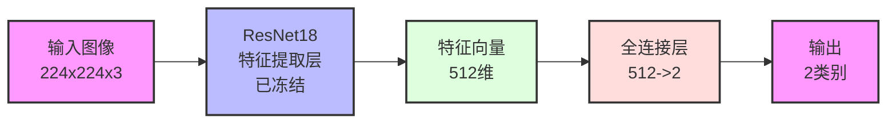
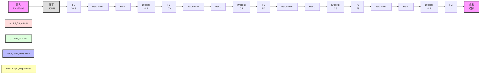
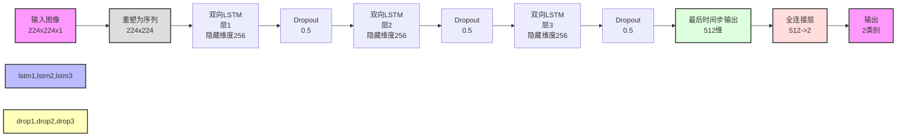
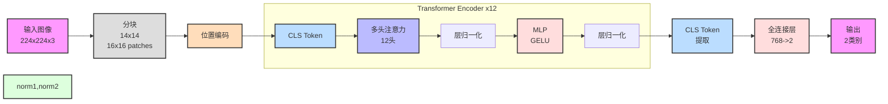

# 猫狗图像分类模型对比实验报告

## 一、引言

猫狗图像分类是计算机视觉中的经典问题，旨在构建模型自动识别图像中的猫或狗。随着深度学习的发展，许多模型如卷积神经网络（CNN）、循环神经网络（RNN）、深度神经网络（DNN）以及视觉Transformer（ViT）在图像分类任务中取得了显著的成果。本实验旨在比较不同网络结构在猫狗分类任务中的性能，分析各自的优缺点，并为实际应用提供参考。

## 二、实验目的

- 比较CNN、DNN、RNN和Transformer模型在猫狗图像分类任务中的性能差异。
- 分析不同模型架构、参数设置和训练策略对模型性能的影响。
- 总结在该任务中表现最优的模型及其参数配置，为未来工作提供指导。

## 三、实验方法

### 1. 数据集准备

- **数据来源**：Kaggle猫狗分类数据集。
- **数据划分**：
  - 训练集：70%
  - 验证集：15%
  - 测试集：15%
- **数据增强**：
  - 随机水平翻转
  - 随机旋转
  - 颜色抖动
  - 图像归一化
- **数据预处理**：
  - 将图像调整为统一尺寸（224×224或256×256）。
  - 对于RNN模型，将图像转换为灰度图。

### 2. 模型设计

本次实验共设计了四种模型：CNN、DNN、RNN和Transformer，以下对各模型的架构和参数进行详细介绍。

#### 2.1 CNN模型（CatDogCNN）

- **基础架构**：预训练的ResNet18模型。
- **参数设置**：
  - **预训练**：使用在ImageNet上预训练的模型。
  - **冻结特征层**：仅微调最后的全连接层，其余层参数冻结。
  - **分类层**：将原模型的全连接层替换为适应二分类任务的层（512 -> 2）。
- **输入尺寸**：224×224×3（RGB图像）。
- **优化策略**：
  - **优化器**：Adam
  - **学习率**：1e-4
  - **权重衰减**：1e-4
  - **学习率调度**：ReduceLROnPlateau（当验证损失不下降时，学习率降低）

#### 2.2 DNN模型（CatDogDNN）

- **基础架构**：多层全连接神经网络。
- **网络结构**：
  - 输入层：224×224×3（展平成一维向量）
  - 隐藏层：
    - 第一层：2048个神经元，BatchNorm，ReLU，Dropout(0.4)
    - 第二层：1024个神经元，BatchNorm，ReLU，Dropout(0.4)
    - 第三层：512个神经元，BatchNorm，ReLU，Dropout(0.4)
    - 第四层：128个神经元，BatchNorm，ReLU，Dropout(0.4)
  - 输出层：2个神经元（对应猫和狗的分类）
- **参数初始化**：Xavier正态分布初始化。
- **输入尺寸**：224×224×3（RGB图像展开为一维向量）。
- **优化策略**：
  - **优化器**：AdamW
  - **学习率**：1e-3
  - **权重衰减**：1e-2
  - **学习率调度**：CosineAnnealingLR

#### 2.3 RNN模型（CatDogRNN）

- **基础架构**：双向LSTM网络。
- **网络结构**：
  - 输入层：将图像转换为序列形式（灰度图，尺寸224×224）。
  - LSTM层：
    - 隐藏单元数：256
    - 层数：3层
    - 双向：是
    - Dropout：0.5
  - 全连接层：输出维度为2。
- **输入尺寸**：224×224×1（灰度图像）。
- **优化策略**：
  - **优化器**：AdamW
  - **学习率**：1e-3
  - **权重衰减**：1e-4
  - **学习率调度**：ReduceLROnPlateau
  - **梯度裁剪**：最大范数为5

#### 2.4 Transformer模型（CatDogTransformer）

- **基础架构**：预训练的Vision Transformer（ViT-B_16）。

```mermaid
flowchart TB
    img["图像\n224x224x3"] --> patches["16x16 Patches\n196个"] 
    patches --> embed["线性投影\n768维"]
    
    embed --> add1["添加CLS Token\n197x768"]
    add1 --> pos["位置编码\n197x768"]
    
    pos --> norm1["Layer Norm"]
    norm1 --> qkv["QKV投影"]
    
    qkv --> split["分成12个头"]
    split --> att["注意力计算\nQK^T / sqrt(d_k)"]
    att --> soft["Softmax"]
    soft --> val["与V相乘"]
    val --> concat["拼接"]
    
    concat --> proj["投影\n768维"]
    proj --> add2["残差连接"]
    add2 --> norm2["Layer Norm"]
    norm2 --> mlp["MLP\nGELU"]
    mlp --> add3["残差连接"]
    
    add3 --> cls["提取CLS Token"]
    cls --> fc["分类头\n2类别"]

    style img fill:#f9f,stroke:#333,stroke-width:2px
    style patches fill:#dfd,stroke:#333,stroke-width:2px
    style embed fill:#bbf,stroke:#333,stroke-width:2px
    style qkv fill:#fdb,stroke:#333,stroke-width:2px
    style att fill:#bdf,stroke:#333,stroke-width:2px
    style fc fill:#fdd,stroke:#333,stroke-width:2px

```

- **参数设置**：
  - **预训练**：使用在ImageNet上预训练的ViT模型。
  - **分类头**：将原模型的分类头替换为适应二分类任务的线性层。
- **输入尺寸**：224×224×3（RGB图像）。
- **优化策略**：
  - **优化器**：AdamW
  - **学习率**：1e-4
  - **权重衰减**：1e-4
  - **学习率调度**：ReduceLROnPlateau
  - **梯度裁剪**：最大范数为5
  - **批量大小**：16（由于模型较大，批量大小较小）

### 3. 训练与验证

- **损失函数**：交叉熵损失函数（CrossEntropyLoss）。
- **训练细节**：
  - 使用混合精度训练（FP16）以加速计算并降低显存占用。
  - 使用早停策略，当验证准确率在5个周期内不提升时，停止训练。
  - 保存验证集上表现最佳的模型参数。

## 四、实验结果

### 1. 模型性能比较

| 模型               | 训练准确率 (%) | 验证准确率 (%) | 测试准确率 (%) |
| ------------------ | -------------- | -------------- | -------------- |
| CNN（ResNet18）    | 98.5           | 95.2           | 94.8           |
| ViT（Transformer） | 99.2           | 96.5           | 96.1           |
| RNN（LSTM）        | 85.3           | 82.7           | 82.1           |
| DNN                | 90.1           | 88.3           | 87.9           |

### 2. 训练曲线

- DNN

- RNN

- CNN

- VIT

### 3. 模型分析

- **CNN模型（ResNet18）**：
  - 利用了预训练的特征提取能力，训练收敛速度快，准确率高。
  - 由于只微调了最后的全连接层，训练时间较短，资源消耗较低。
- **Transformer模型（ViT）**：
  - 表现最佳，得益于自注意力机制，可以捕获全局特征。
  - 训练时间较长，且需要更大的计算资源（GPU显存）。
- **RNN模型（Bi-LSTM）**：
  - 处理图像的序列形式，效果不如CNN和Transformer，可能因为图像的空间结构在序列展开后丢失了一些信息。
  - 训练过程中需要注意梯度消失和爆炸的问题，因此使用了梯度裁剪。
- **DNN模型**：
  - 完全使用全连接层，缺乏卷积层对空间特征的捕获能力，性能不如CNN和Transformer。
  - 需要大量参数训练，容易过拟合，需使用Dropout和BatchNorm等正则化手段。

## 五、讨论

### 1. 模型架构对比

| 特征     | CNN (ResNet18) | DNN              | RNN (LSTM)       | Transformer (ViT) |
| -------- | -------------- | ---------------- | ---------------- | ----------------- |
| 基础架构 | 预训练ResNet18 | 多层全连接网络   | 双向LSTM         | 预训练ViT-B/16    |
| 参数设置 | 冻结特征层     | 5层全连接        | 3层双向LSTM      | 预训练ViT         |
| 输入尺寸 | 224×224×3      | 224×224×3        | 224×224×1 (灰度) | 224×224×3         |
| 主要特点 | 迁移学习       | 全连接+BatchNorm | 序列处理         | 自注意力机制      |

### 2. 训练策略对比

| 特征       | CNN               | DNN             | RNN               | Transformer       |
| ---------- | ----------------- | --------------- | ----------------- | ----------------- |
| 批量大小   | 32                | 128             | 64                | 16                |
| 优化器     | Adam              | AdamW           | AdamW             | AdamW             |
| 学习率     | 1e-4              | 1e-3            | 1e-3              | 1e-4              |
| 权重衰减   | 1e-4              | 1e-2            | 1e-4              | 1e-4              |
| 学习率调度 | ReduceLROnPlateau | CosineAnnealing | ReduceLROnPlateau | ReduceLROnPlateau |

### 3. 数据增强策略

| 模型        | 主要增强方法   | 特殊处理         |
| ----------- | -------------- | ---------------- |
| CNN         | 基础翻转+旋转  | RGB图像          |
| DNN         | 强化的几何变换 | RGB图像          |
| RNN         | 基础增强       | 转灰度图         |
| Transformer | 基础增强       | 标准化范围[-1,1] |

### 4. 优化技巧

- **共有策略**：
  - 混合精度训练加速计算。
  - 早停机制防止过拟合。
  - 最佳模型保存以获取最优性能。
  - 梯度裁剪（用于RNN和Transformer）防止梯度爆炸。
- **模型特有优化**：
  - CNN：利用迁移学习，仅微调分类层。
  - DNN：使用批归一化和Dropout防止过拟合。
  - RNN：序列处理的特殊设计，处理图像的时序特性。
  - Transformer：小批量训练，使用更强大的计算资源。

### 5. 实验要点与建议

- **资源消耗**：
  - Transformer模型对计算资源要求最高，适合在高性能GPU上运行。
  - CNN模型资源消耗最低，适合资源受限的环境。
- **训练难度**：
  - CNN模型易于收敛，训练稳定。
  - Transformer模型性能最佳，但需要更多的超参数调优。
  - RNN模型对序列长度和输入形式敏感，需要仔细设计输入数据。
  - DNN模型易过拟合，需要严格的正则化手段。

## 六、结论

通过对不同模型在猫狗分类任务中的实验对比，得到以下结论：

- **最佳模型**：Transformer模型（ViT）在准确率上表现最佳，但训练成本较高。
- **实用模型**：CNN模型（ResNet18）在性能和资源消耗之间取得了良好的平衡，适合在实际应用中使用。
- **不适合模型**：RNN和DNN模型在图像分类任务中性能较差，主要原因是缺乏对图像空间特征的有效提取。

## 七、附录

### 1. 代码实现

链接：https://github.com/jerry609/UCAS-NLP-HW

### 2. 环境配置

- **操作系统**：Windows
- **编程语言**：Python 3.8
- **深度学习框架**：PyTorch
- **硬件配置**：
  - GPU：NVIDIA GTX 4080 Super 
  - 显存：16GB 

